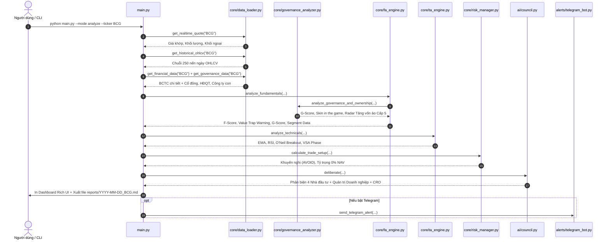

# 📐 TÀI LIỆU THIẾT KẾ KIẾN TRÚC & MÔ HÌNH ĐỊNH LƯỢNG (ARCHITECTURE & FORMULAS)

> Tài liệu kỹ thuật chi tiết dành cho các chuyên gia dữ liệu, lập trình viên và các mô hình AI tiếp quản dự án.

---

## 1. MÔ HÌNH TOÁN HỌC & ĐỊNH LƯỢNG (QUANTITATIVE MODELS)

### A. Chỉ số Sức khỏe Tài chính Piotroski F-Score (Thang điểm 0 - 9)
Chỉ số này do Giáo sư Joseph Piotroski phát triển nhằm chấm điểm sức khỏe tài chính doanh nghiệp:
* **Khả năng sinh lời (Profitability):**
  1. $ROA > 0$: +1 điểm (Lợi nhuận ròng trên tổng tài sản dương).
  2. $ROE > 10\%$: +1 điểm (Hiệu quả sử dụng vốn chủ sở hữu tốt).
  3. $\Delta ROA > 0$ hoặc Tăng trưởng LNST dương: +1 điểm.
  4. Tăng trưởng LNST $> 15\%$: +1 điểm.
* **Đòn bẩy tài chính & Thanh khoản (Leverage & Liquidity):**
  5. $Debt / Equity < 1.0$: +2 điểm (Nợ vay trong tầm kiểm soát an toàn).
  6. $Debt / Equity \in [1.0, 1.8]$: +1 điểm.
* **Hiệu quả hoạt động (Operating Efficiency):**
  7. Biên lợi nhuận gộp $Gross Margin > 15\%$: +1 điểm.
  8. Biên lợi nhuận ròng $Net Margin > 8\%$: +1 điểm.
  9. Tăng trưởng Doanh thu thuần $> 8\%$: +1 điểm.

### B. Định giá theo Phong cách Warren Buffett & Biên An Toàn (Margin of Safety)
* **Con hào kinh tế (Moat):** $ROE \ge 15\%$ và $ROIC \ge 12\%$ liên tục.
* **Giá trị hợp lý ước tính (Fair Value):**
  $$FairValue = CurrentPrice \times \left( \frac{TargetPE}{CurrentPE} \right)$$
  *(Với $TargetPE \approx 15.0$ cho các doanh nghiệp đầu ngành tại Việt Nam).*
* **Biên an toàn (Margin of Safety - MoS):**
  $$MoS = \frac{FairValue - CurrentPrice}{FairValue} \times 100\%$$
  Khuyến nghị mua khi $MoS \ge 20\%$.

### C. Định giá theo Phong cách Peter Lynch (GARP & PEG)
* **Hệ số PEG:**
  $$PEG = \frac{P/E}{EPS\ Growth\ Rate\ (\% Doanh\ thu\ hoặc\ Lợi\ nhuận)}$$
* **Quy chuẩn đánh giá:**
  * $PEG \le 0.7$: Cổ phiếu tăng trưởng siêu rẻ (Fast Grower Undervalued) $\rightarrow$ Khuyến nghị **MUA MẠNH**.
  * $0.7 < PEG \le 1.0$: Mức giá hợp lý (GARP) $\rightarrow$ Khuyến nghị **MUA**.
  * $PEG > 1.5$: Định giá đã chạy trước tốc độ tăng trưởng $\rightarrow$ Khuyến nghị **QUAN SÁT/THẬN TRỌNG**.

### D. Hệ thống Động lượng William O'Neil & Mark Minervini (CANSLIM)
* **Trend Template (Bộ lọc Xu hướng):**
  1. $Price > EMA20$
  2. $EMA20 > EMA50$
  3. Đường $EMA50$ dốc lên.
* **Bùng nổ Khối lượng (Volume Spike):**
  $$Volume_{today} \ge 1.3 \times MA20_{volume}$$
  Chứng minh có sự tham gia bảo trợ giá của các quỹ đầu tư tổ chức (Institutional Sponsorship).
* **Điểm Bứt Phá Nền Giá (Breakout Pivot):**
  $$Price \ge Resistance_{20\ phiên} \quad \text{và} \quad Volume \ge 1.3 \times MA20_{vol}$$

### E. Quản trị Rủi ro & Tỷ lệ Lợi nhuận / Rủi ro (Chief Risk Officer)
* **Điểm Cắt Lỗ Cứng (Stop Loss):**
  $$StopLoss = \max(Support_{20d},\ CurrentPrice - 1.5 \times ATR_{14})$$
  **Giới hạn trần:** Tuyệt đối không để mức cắt lỗ vượt quá **7%** từ giá mua ($StopLoss \ge CurrentPrice \times 0.93$).
* **Tỷ lệ Risk / Reward (R:R):**
  $$R:R = \frac{TakeProfit_1 - Entry}{Entry - StopLoss}$$
  Hệ thống **chỉ phê duyệt tín hiệu MUA** khi $R:R \ge 2.0:1$.

### F. Định giá theo Khối tài sản ròng & Radar Cảnh báo Thao túng giá ảo (Asset-Based Valuation & Manipulation Radar)
Mô hình này giải quyết triệt để bài toán: **Thị giá cổ phiếu có tương xứng với tài sản thực tế không, hay đang bị đội lái thổi phồng giá ảo?**

* **Giá trị Sổ sách mỗi cổ phiếu (Book Value Per Share - BVPS):**
  $$BVPS = \frac{\text{Vốn chủ sở hữu}}{\text{Số lượng CP lưu hành}}$$
* **Hệ số Định giá Tài sản ($P/B$):**
  $$P/B = \frac{CurrentPrice}{BVPS}$$
* **Mức Chiết khấu / Thặng dư Tài sản ròng:**
  $$\Delta_{Asset}\% = \frac{BVPS - CurrentPrice}{BVPS} \times 100\%$$
* **Thang đo 5 Cấp độ Rủi ro Thao túng & Thổi giá ảo (Manipulation Risk Levels):**
  1. **Cấp 1 - Món hời tài sản (Asset Bargain):** $P/B < 1.0x$. Thị giá thấp hơn cả vốn chủ sở hữu ròng. Rủi ro thổi giá: **RẤT THẤP** (Tài sản thực là tấm đệm bảo toàn vốn).
  2. **Cấp 2 - Định giá hợp lý (Fair Value):** $P/B \in [1.0x, 2.2x]$ đi kèm $ROE \ge 10\%$. Thị giá phản ánh đúng quy mô tài sản và năng lực sinh lời.
  3. **Cấp 3 - Định giá cao (Valuation Premium):** $P/B \in [2.2x, 3.8x]$. Đòi hỏi tăng trưởng EPS cao và Moat bền vững.
  4. **Cấp 4 - Cảnh báo Bong bóng đầu cơ (Speculative Bubble):** $P/B > 3.8x$ nhưng $ROE < 10\%$ hoặc lợi nhuận lẹt đẹt. Thị trường đang mua kỳ vọng ảo, nguy cơ điều chỉnh mạnh.
  5. **Cấp 5 - BÁO ĐỘNG ĐỎ: Thao túng / Bơm thổi giá ảo (High Manipulation):** $P/B > 5.0x - 10.0x$ trong khi ROE $< 5\%$ hoặc lỗ triền miên. Dấu hiệu điển hình của việc thao túng giá, đội lái đẩy thị giá thoát ly hoàn toàn giá trị thực của tài sản.
* **Kiểm định Chất lượng Tài sản (Asset Quality Check):**
  * Tỷ lệ tài sản đọng vốn: $\frac{\text{Phải thu} + \text{Tồn kho}}{\text{Tổng tài sản}} > 65\% \rightarrow$ Cảnh báo tài sản trên giấy tờ, rủi ro nợ xấu hoặc chôn vốn lớn.
  * Bộ đệm tiền mặt: $\frac{\text{Tiền mặt \& Tiền gửi}}{\text{Tổng tài sản}} \ge 10\% \rightarrow$ Khả năng phòng thủ thanh khoản tốt.

### G. Bóc tách Mô hình Kinh doanh Cốt lõi & Phân tích Phân khúc (Core Business Segment Breakdown)
Phân tích sâu cơ cấu đóng góp của từng bộ phận hoạt động trong doanh nghiệp đa ngành:
* **Tỷ trọng Doanh thu (% Revenue Share):** Mảng nào mang lại dòng tiền quy mô lớn nhất (Scale Base).
* **Tỷ trọng Lợi nhuận gộp (% Gross Profit Share):** Mảng nào là động lực tạo ra tiền thật.
* **Biên lợi nhuận gộp từng mảng (Gross Margin by Segment):**
  * **Con bò sữa tạo tiền (Cash Cow):** Mảng có biên lãi gộp cao vượt trội (như Thủy điện biên lãi $>60\%$), tạo dòng tiền mặt liên tục quanh năm để tài trợ lãi vay và nuôi các dự án đầu tư dài hạn.
  * **Trụ cột quy mô (Scale Base):** Mảng tạo doanh số lớn và dòng việc làm (như Xây lắp hạ tầng chiếm $>75\%$ DT).
  * **Ngòi nổ tăng trưởng đột biến (Growth Catalyst):** Mảng tạo lợi nhuận bùng nổ theo chu kỳ bàn giao (như Bất động sản khu đô thị biên lãi $40-50\%$).
  * **Động lực tương lai (Future Bet):** Dự án công nghiệp/vật liệu mới mở rộng chuỗi giá trị dài hạn.

### H. Mô hình Đánh giá Quản trị Doanh nghiệp, Cơ cấu Cổ đông & Radar Phát hiện Tăng vốn ảo / Trái phiếu hệ sinh thái (Corporate Governance & Circular Capital Audit)
Mô hình này sinh ra để bẻ gãy triệt để "bẫy giá trị" (Value Trap) điển hình trên TTCK Việt Nam (như trường hợp Bamboo Capital - BCG, FLC...), nơi doanh nghiệp dùng mạng lưới công ty con để tăng vốn ảo, phát hành trái phiếu nội khối và che giấu dòng tiền:

* **Bóc tách Cơ cấu Cổ đông (Shareholder Structure):**
  * Tỷ lệ trôi nổi (Free Float %): Phân loại cô đặc vs phân mảnh đầu cơ (>70%).
  * Sở hữu Nhà nước (%) & Quỹ ngoại (%): Bộ đệm minh bạch và giám sát tổ chức.
  * Nhận diện pháp nhân sân sau: Phát hiện lãnh đạo sở hữu phân tán qua các công ty TNHH cá nhân / công ty đầu tư vệ tinh để chuyển giá.
* **Kiểm định Ban Lãnh đạo & Hội đồng Quản trị (Board & Leadership Integrity):**
  * **Skin in the game:** Tỷ lệ nắm giữ của ban điều hành đương nhiệm. Nắm $<1\%$ vốn cảnh báo nguy cơ làm thuê vô trách nhiệm hoặc đã bán tháo tháo chạy.
  * Cảnh báo biến cố pháp lý / nợ BCTC kiểm toán.
* **Radar Tăng vốn ảo & Trái phiếu Hệ sinh thái (Circular Capital & Shell Network Radar):**
  * Nhận diện mô hình Holding phức hợp: Số lượng công ty con $\ge 6$ và liên kết $\ge 2$.
  * **Điều kiện kích hoạt Báo động đỏ Cấp 5/5 (Circular Capital Fraud Risk):**
    $$\text{Số cty con} \ge 6 \quad \text{và} \quad \frac{\text{Phải thu}}{\text{Tổng tài sản}} > 30\% \quad \text{và} \quad \frac{\text{Tổng nợ vay}}{\text{Tiền mặt}} > 4.5x$$
  * **Cơ chế bóc tách:**
    1. Công ty con/liên kết phát hành trái phiếu hoặc vay ngân hàng bằng tài sản dự án dở dang/cổ phần chưa niêm yết làm tài sản bảo đảm.
    2. Vốn huy động được phân tán qua các hợp đồng "Hợp tác đầu tư / Ủy thác tài chính / Đặt cọc", tích tụ thành các khoản Phải thu khổng lồ.
    3. Tự ghi nhận doanh thu tài chính nội khối để bù đắp chi phí lãi vay, dòng tiền CFO thực tế âm nặng.
* **Cải tiến Định vị Bẫy Giá trị (Value Trap Fix):**
  * Khi $P/B < 1.0x$ nhưng tài sản đọng vốn $(\text{Phải thu} + \text{Tồn kho}) / \text{Tổng tài sản} > 38\%$ hoặc Nợ vay / Tiền mặt $> 4.5x$: **Hệ thống KHÔNG xếp vào Món hời tài sản mà lập tức cảnh báo BẪY GIÁ TRỊ (Value Trap)**, phạt điểm an toàn vốn từ 90 điểm xuống 20 điểm.
* **Thang điểm Quản trị Doanh nghiệp (G-Score: 0 - 100):**
  * $G \ge 80$: Quản trị Minh bạch & An toàn (Exemplary).
  * $60 \le G < 80$: Quản trị Đạt chuẩn (Adequate).
  * $40 \le G < 60$: Rủi ro Quản trị Đáng ngờ (Questionable).
  * $G < 40$: BÁO ĐỘNG ĐỎ: RỦI RO QUẢN TRỊ NGHIÊM TRỌNG (HIGH GOVERNANCE RISK).

---

## 2. QUY TRÌNH LUỒNG DỮ LIỆU THỰC TẾ (DATA PIPELINE)

